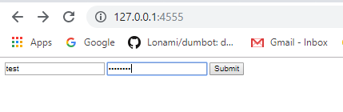
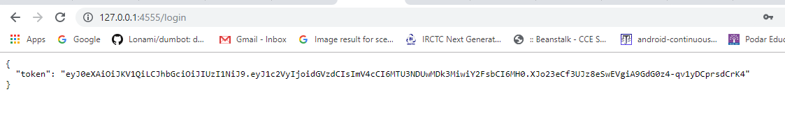
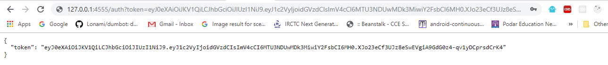
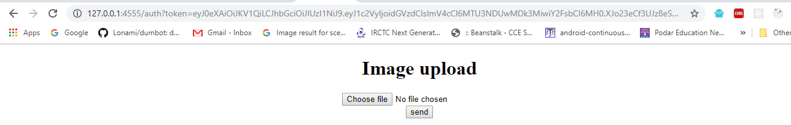
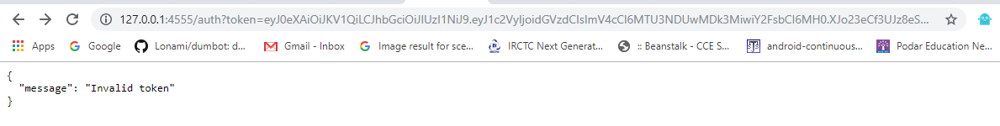
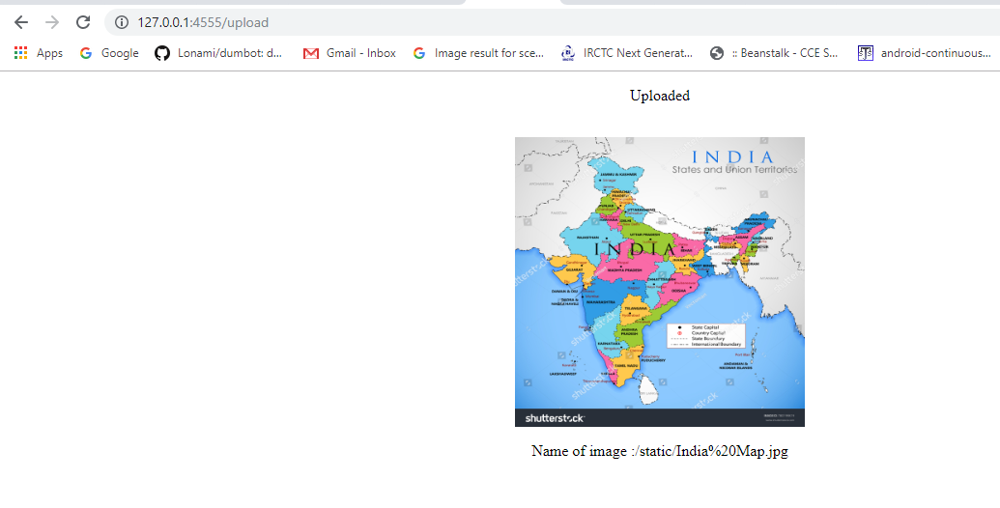

# Flask_api  
## Steps -  
Clone the repo and open cmd ,and type python app.py
  
  The server runs on localhost and do the following for authentication and uploading image -   
      
  Token - 
    
  Copy paste the token in URL as 127.0.0.1/4555/auth?token=.......................    
    
  Upload the image  
   
  Token expires after 60 secs  
    
  Uploaded image with name-    
    
  
